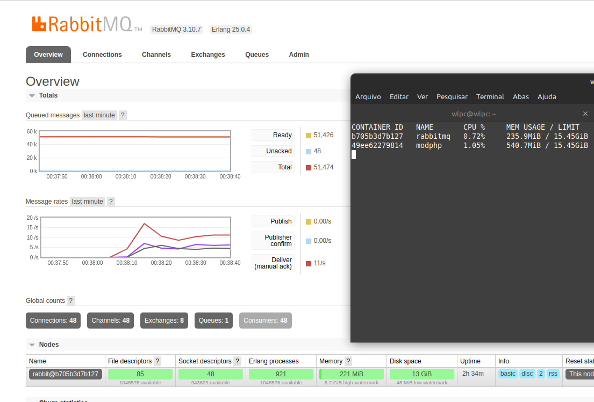

# RabbitRun - Mecanismo de fila

Mecanismo de fila utilizando a combinação do RabbitMQ e MySQL

- O RabbitMQ para entrega e distribuição da tarefa entre os workers
- O MySQL para conter detalhes sobre quais tarefas foram executadas e também quais devem ser ignoradas na fila

Combinando o MySQL junto ao RabbitMQ, é possível pesquisar e excluir/ignorar itens da fila de forma simples, o que não é
possível somente com o RabbitMQ, devido as limitações dele em procurar itens dentro da fila

**Workers**: É possível ter vários workers consumindo a fila ao mesmo tempo, pois o rabbit mq trata a distribuição de
tarefa entre eles.

## Requisitos

- MySQL
- PHP >= 7.3 com PDO
- RabbitMQ >= 3.8 (Filas do tipo Quorum são necessárias)

## Demonstração

**Consumo de hardware baixo com 50k de mensagens e 40 workers**



## Criar tabela de background jobs

```sql
drop table if exists jobs;

create table jobs
(
    id              bigint auto_increment primary key,
    queue           varchar(255) not NULL COMMENT 'queue name',
    payload         text         not NULL COMMENT 'json content, filter with JSON_EXTRACT',
    retries         int          not null default 0,
    max_retries     int          not null default 10,
    requeue_error   boolean               default true,
    last_error      text COMMENT 'last error description',
    status_desc     text COMMENT 'cancel/other status reason',
    id_owner        bigint COMMENT 'ID to determine the owner (user) of the item in the queue',
    id_object       bigint COMMENT 'ID to determine which object the queue item came from (ex: user, product and etc)r',
    auto_delete_end boolean               default false,
    status          enum('waiting','processing','canceled','error','success') default 'waiting',
    start_at        datetime,
    end_at          datetime,
    INDEX           idx_id_object (id_object),
    INDEX           idx_queue (queue),
    INDEX           idx_id_owner (id_owner)
);
```

## Customizar o nome da tabela

Caso queira customizar o nome da tabela, é possível passando para o construtor da classe Queue, o nome da tabela

```php
(new \WillRy\RabbitRun\Queue\Queue("nome_tabela"))
    ->configRabbit(
        "rabbitmq", //rabbitmq host
        "5672", //rabbitmq port
        "admin", //rabbitmq user
        "admin", //rabbitmq password
        "/" //rabbitmq vhost
    )->configPDO(
        'mysql', //pdo driver
        'db', //pdo host
        'env_db', //pdo db_name
        'root', //pdo username
        'root', //pdo password
        3306 //pdo port
    );
```

## Como publicar itens na fila?

```php
<?php

require_once __DIR__ . '/../../vendor/autoload.php';

$driver = new \WillRy\RabbitRun\Drivers\PdoDriver(
    'mysql',
    'db',
    'env_db',
    'root',
    'root',
    3306
);

$worker = (new \WillRy\RabbitRun\Queue\Queue($driver))
    ->configRabbit(
        "rabbitmq", //rabbitmq host
        "5672", //rabbitmq port
        "admin", //rabbitmq user
        "admin", //rabbitmq password
        "/" //rabbitmq vhost
    );

for ($i = 0; $i <= 9; $i++) {
    $job = new \WillRy\RabbitRun\Queue\Job([
        "id_email" => rand(),
        "conteudo" => "blablabla"
    ]);

    /** optional */
    $job->setRequeueOnError(true);
    $job->setMaxRetries(3);
    $job->setAutoDelete(true);

    $worker
        ->createQueue("queue_teste")
        ->publish($job);
}

```

## Como consumir itens da fila?

- Criar a classe de worker responsavel pelo processament **(Implementar a interface WorkerInterface)**

```php
<?php

use PhpAmqpLib\Message\AMQPMessage;

class EmailWorker implements \WillRy\RabbitRun\Queue\WorkerInterface
{

    public function handle(\WillRy\RabbitRun\Queue\Task $data)
    {
        $body = $data->getData();
        $database = $data->getDatabaseData();

        /**
         * Fazer o processamento que for necessário
         */

        //simulando um erro qualquer para exemplo
        $fakeException = rand() % 2 === 0;
        if ($fakeException) throw new \Exception("=== Erro ===");

        /** Marca o item como sucesso */
        $data->ack();


        /** Marca o item como erro */
        //$data->nackError();

        /** Marca o item como cancelado */
        //$data->nackCancel();
    }


    public function error(array $databaseData, Exception $error = null)
    {

    }
}

```

- Criar script que consome a fila

```php
<?php

require_once __DIR__ . '/../../vendor/autoload.php';

require_once __DIR__ . "/EmailWorker.php";


$driver = new \WillRy\RabbitRun\Drivers\PdoDriver(
    'mysql',
    'db',
    'env_db',
    'root',
    'root',
    3306
);

$worker = (new \WillRy\RabbitRun\Queue\Queue($driver))
    ->configRabbit(
        "rabbitmq",
        "5672",
        "admin",
        "admin",
        "/"
    );

$worker
    ->createQueue("queue_teste")
    ->consume(
        new EmailWorker()
    );

```

## Tratamento de erros e sucesso

Dentro da classe de worker, deverá ser implementada a interface **WorkerInterface**, que torna obrigatório 2 metodos:

- **handle:** Processa a tarefa
- **error:** Callback executado quando ocorre um erro

Todos **as exceptions lançadas no método handle**, serão interceptadas automaticamente para que o item seja marcado
como **erro** e seja **recolocado na fila** se necessário

## OBRIGATÓRIO

- Sempre execute um: **nack**, **nackCancel** ou **nackError** para que a tarefa tenha um tratamento e não fique
  infinito na fila.

- nack: marca como sucesso
- nackCancel: marca a tarefa como cancelada
- nackError: marca a tarefa como erro, tratando automaticamente o requeue

## Demonstração

Dentro desse repositório tem a pasta **demo**, contendo dois arquivos:

- **publisher.php**: Arquivo que publica itens na fila
- **consumer.php**: Arquivo que consome itens na fila, podendo ter várias instâncias
