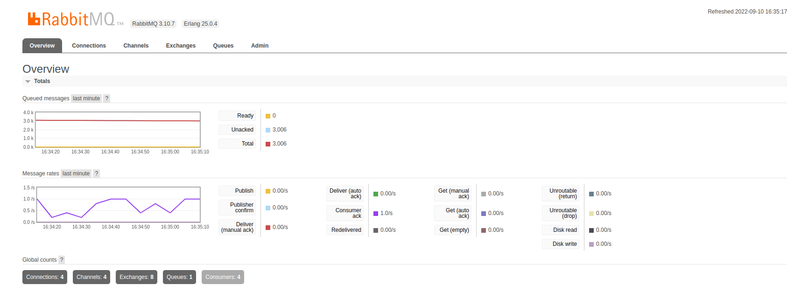
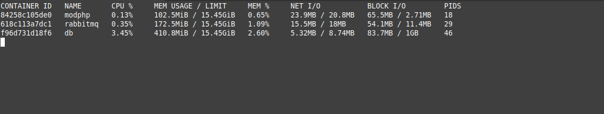

# RabbitRun - Mecanismo de fila

Mecanismo de fila utilizando a combinação do RabbitMQ e MySQL

- O RabbitMQ para entrega e distribuição da tarefa entre os workers
- O MySQL para conter detalhes sobre quais tarefas foram executadas e também quais devem ser ignoradas na fila

Combinando o MySQL junto ao RabbitMQ, é possível pesquisar e excluir/ignorar itens da fila de forma simples, o que não
é possível somente com o RabbitMQ, devido as limitações dele em procurar itens dentro da fila

## Requisitos

- MySQL
- PHP >= 7.3 com PDO
- RabbitMQ >= 3.8 (Filas do tipo Quorum são necessárias)

## Demonstração

**3k de mensagens**



**Consumo de hardware baixo com 3k de mensagens e 4 workers**



## Criar tabela de background jobs

```sql
drop table if exists jobs;

create table jobs(
 id bigint auto_increment primary key,
 tag text not null,
 queue varchar(255) not null,
 payload text not null,
 retries int not null default 0,
 max_retries int not null default 10,
 requeue_error boolean default true,
 status enum('waiting','processing','canceled','error','success') default 'waiting',
 start_at datetime,
 end_at datetime
);
```

## Como publicar itens na fila?

```php
<?php

require_once __DIR__ . '/../vendor/autoload.php';

$worker = (new \WillRy\RabbitRun\Queue())
    ->configRabbit(
        "rabbitmq",
        "5672",
        "admin",
        "admin",
        "/"
    )->configPDO(
        'mysql',
        'db',
        'env_db',
        'root',
        'root',
        3306
    );

for ($i = 0; $i <= 300; $i++) {
    $worker
        ->createQueue("queue_teste")
        ->publish(
            [
                "id_email" => rand(),
                "conteudo" => "blablabla"
            ],
        );
}

```

## Como consumir itens da fila?

- Criar a classe de worker responsavel pelo processament **(Implementar a interface WorkerInterface)**


```php
<?php

use PhpAmqpLib\Message\AMQPMessage;

class EmailWorker implements \WillRy\RabbitRun\WorkerInterface
{

    public function handle(\WillRy\RabbitRun\Task $data)
    {
        $body = $data->getData();
        $database = $data->getDatabaseData();

        var_dump($body, $database);

        $fakeException = rand() % 2 === 0;
//        $fakeException = true;
        if ($fakeException) throw new \Exception("=== Erro ===");


//            print("Sucesso:{$body->id_email}".PHP_EOL);

        $data->ack();
    }


    public function error(array $data, Exception $error = null)
    {
        print_r("=== Erro ===" . PHP_EOL);
    }
}

```

- Criar script que consome a fila

```php
<?php

require_once __DIR__ . '/../vendor/autoload.php';

require_once __DIR__ . "/Consumers/EmailWorker.php";


$worker = (new \WillRy\RabbitRun\Queue())
    ->configRabbit(
        "rabbitmq",
        "5672",
        "admin",
        "admin",
        "/"
    )->configPDO(
        'mysql',
        'db',
        'env_db',
        'root',
        'root',
        3306
    );

$worker
    ->createQueue("queue_teste")
    ->consume(
        new EmailWorker()
    );
```
